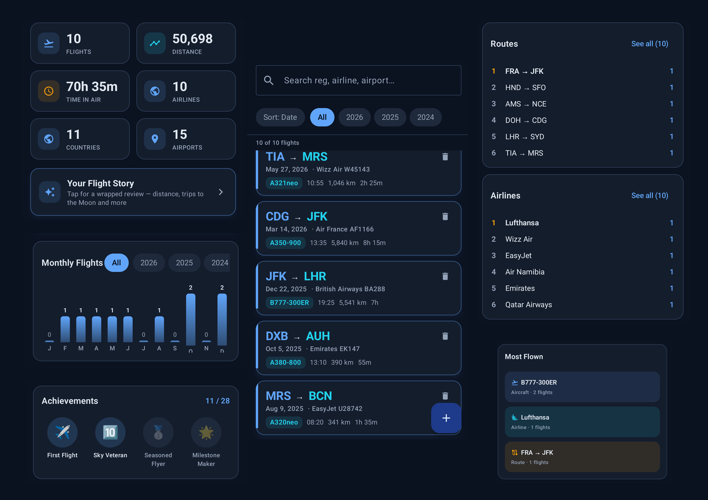

# Flybook

<p align="center">A private, offline flight logbook for Android.</p>

<p align="center"></p>

## Features

- **Log flights** — capture date, flight number, airline, departure/arrival airports, aircraft, registration, seat, cabin class, times, distance, and notes.
- **Smart auto-enrichment** — enter just the airport IATA/ICAO codes and airline, and Flybook fills in the rest from bundled reference data: airport names, cities, countries, airline names, aircraft names, and even computes great-circle distance and estimated duration.
- **Dashboard** — at-a-glance stats (flights, distance, time in air, airlines, countries, airports) plus a monthly activity chart and a collection of unlockable achievements.
- **Your Flight Story** — a "wrapped"-style review of your flying history.
- **Flight map** — every route drawn on an interactive map (osmdroid) with multiple base styles (Standard, Satellite, Terrain, Minimal, Dark), geodesic route lines, and color customization.
- **Stats & rankings** — drill into most-flown aircraft, airlines, routes, airports, tail registrations, seats, and countries, with averages, longest haul, and more highlights.
- **Import / Export** — export your logbook as CSV or JSON, or import an existing CSV using the my.flightradar24.com export format (also compatible with Flybook's own export).
- **Fully offline & private** — all data is stored locally on-device (Room database). No account, no cloud, no tracking.

## Screenshots

<p align="center"></p>

## Usage

1. Tap **+** on the *My Flights* screen to add a flight, or import a CSV.
2. Enter at least a date and departure/arrival airport codes (IATA or ICAO).
3. Any other fields are optional — airline, aircraft, and distance are enriched automatically.
4. Watch your dashboard, map, and achievements grow as you log.

Want to try it with demo data? Tap **Load sample flights** in **Settings**, or import [sample-flights.csv](sample-flights.csv) from a file.

## Download

Get the latest release from the [Releases page](https://github.com/Luchowl/flybook/releases) on GitHub. Download the `flybook-<version>.apk` and install it on your Android device.

> Install by opening the APK on your device (or `adb install flybook-<version>.apk`). You may need to allow installation from unknown sources.

## Getting Started

### Prerequisites

- Android Studio (with the Android SDK)
- JDK 17
- Android SDK 36 (compile/target), min SDK 26 (Android 8.0+)

### Build

```bash
cd android-app
./gradlew assembleDebug
```

The debug APK will be produced at `android-app/app/build/outputs/apk/debug/app-debug.apk`.

### Run

Open `android-app/` in Android Studio, wait for the Gradle sync, and press **Run** on an emulator or connected device. Or install the built APK directly:

```bash
adb install app/build/outputs/apk/debug/app-debug.apk
```

## Privacy

Flybook is built around your privacy:

- **100% local** — your logbook lives in a local database (Room) on your device. Nothing is ever uploaded.
- **No account, no cloud, no tracking** — there is no sign-in, no analytics, and no third-party SDKs collecting your data.
- **Works offline** — the app is fully functional without an internet connection. The only network access is the flight map fetching map tiles from public OpenStreetMap-based tile servers (and only when you open the map).
- **You own your data** — export your logbook anytime as CSV or JSON, and delete it all from the app whenever you like.

## Project Structure

```
android-app/
├── app/src/main/java/com/neonstick/flybook/
│   ├── MainActivity.kt          # App entry point + bottom navigation
│   ├── FlybookApp.kt            # Application class
│   ├── data/                    # Room DB, DAO, repository, reference data, enrichment
│   ├── ui/                      # Theme, shared components, ViewModel
│   ├── ui/screens/              # Dashboard, Flights, Map, Stats, Settings, Wrapped
│   └── util/                    # CSV, stats, formatting helpers
└── app/src/main/assets/         # airports.json, airlines.json, planes.json
```

## License

Released under the [MIT License](LICENSE).
